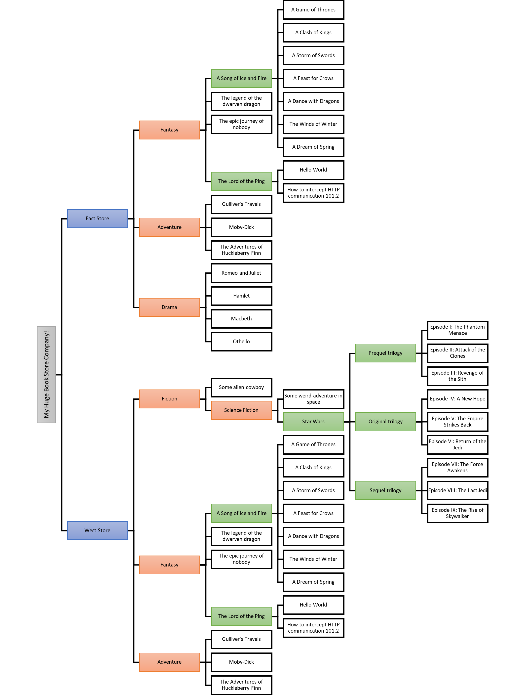

# Chapter 9

The following schema represent the full-size hierarchy of the BookStore project (the legend is bellow).

## Textual version

-   My Huge Book Store Company!
    -   East Store
        -   Fantasy
            -   A Song of Ice and Fire
                -   A Game of Thrones
                -   A Clash of Kings
                -   A Storm of Swords
                -   A Feast for Crows
                -   A Dance with Dragons
                -   The Winds of Winter
                -   A Dream of Spring
            -   The legend of the dwarven dragon
            -   The epic journey of nobody
            -   The Lord of the Ping
                -   Hello World
                -   How to intercept HTTP communication 101.2
        -   Adventure
            -   Gulliver's Travels
            -   Moby-Dick
            -   The Adventures of Huckleberry Finn
        -   Drama
            -   Romeo and Juliet
            -   Hamlet
            -   Macbeth
            -   Othello
    -   West Store
        -   Fiction
            -   Some alien cowboy
            -   Science Fiction
                -   Some weird adventure in space
                -   Star Wars
                    -   Prequel trilogy
                        -   Episode I: The Phantom Menace
                        -   Episode II: Attack of the Clones
                        -   Episode III: Revenge of the Sith
                    -   Original trilogy
                        -   Episode IV: A New Hope
                        -   Episode V: The Empire Strikes Back
                        -   Episode VI: Return of the Jedi
                    -   Sequel trilogy
                        -   Episode VII: The Force Awakens
                        -   Episode VIII: The Last Jedi
                        -   Episode IX: The Rise of Skywalker
        -   Fantasy
            -   A Song of Ice and Fire
                -   A Game of Thrones
                -   A Clash of Kings
                -   A Storm of Swords
                -   A Feast for Crows
                -   A Dance with Dragons
                -   The Winds of Winter
                -   A Dream of Spring
            -   The legend of the dwarven dragon
            -   The epic journey of nobody
            -   The Lord of the Ping
                -   Hello World
                -   How to intercept HTTP communication 101.2
        -   Adventure
            -   Gulliver's Travels
            -   Moby-Dick
            -   The Adventures of Huckleberry Finn
