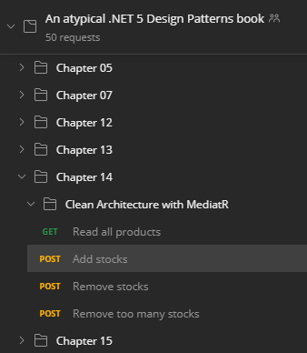

## $5 Tech Unlocked 2021!

## [Buy and download this product for only $5 on PacktPub.com](https://www.packtpub.com/)

_The $5 campaign runs from **December 15th 2020** to **January 13th 2021.**_

# An Atypical ASP.NET Core 5 Design Patterns Guide

<a href="https://www.packtpub.com/product/an-atypical-asp-net-core-5-design-patterns-guide/9781789346091?utm_source=github&utm_medium=repository&utm_campaign=9781789346091"></a>

This is the code repository for [An Atypical ASP.NET Core 5 Design Patterns Guide](https://www.packtpub.com/product/an-atypical-asp-net-core-5-design-patterns-guide/9781789346091?utm_source=github&utm_medium=repository&utm_campaign=9781789346091), published by Packt.

**A SOLID adventure into architectural principles, design patterns, .NET 5, and C#**

## What is this book about?

Design patterns are a set of solutions to many of the common problems occurring in software development. Knowledge of these design patterns helps developers and professionals to craft software solutions of any scale.

This book covers the following exciting features:

-   Apply the SOLID principles for building flexible and maintainable software
-   Get to grips with .NET 5 dependency injection
-   Work with GoF design patterns such as strategy, decorator, and composite
-   Explore the MVC patterns for designing web APIs and web applications using Razor
-   Discover layering techniques and tenets of clean architecture

If you feel this book is for you, get your [copy](https://www.amazon.com/dp/1789346096) today!

<a href="https://www.packtpub.com/?utm_source=github&utm_medium=banner&utm_campaign=GitHubBanner"></a>

## Instructions and Navigations

All of the code is organized into folders. For example, Chapter02.

The code will look like the following:

```csharp
public class InlineDataTest
{
    [Theory]
    [InlineData(1, 1)]
    [InlineData(2, 2)]
    [InlineData(5, 5)]
    public void Should_be_equal(int value1, int value2)
    {
        Assert.Equal(value1, value2);
    }
}
```

**Following is what you need for this book:**

This design patterns book is for beginners as well as intermediate-level software and web developers with some knowledge of .NET who want to write flexible, maintainable, and robust code for building scalable web applications. Knowledge of C# programming and an understanding of web concepts like HTTP is necessary.

With the following software and hardware list you can run all code files present in the book (Chapter 1-18).

### Software and Hardware List

| Chapter | Software required                         | OS required                        |
| ------- | ----------------------------------------- | ---------------------------------- |
| 1-18    | .NET 5                                    | Windows, Mac OS X, and Linux (Any) |
| 1-18    | ASP.NET Core 5                            | Windows, Mac OS X, and Linux (Any) |
| 1-18    | C# 9.0                                    | Windows, Mac OS X, and Linux (Any) |
| 1-18    | xUnit                                     | Windows, Mac OS X, and Linux (Any) |
| 1-18    | Multiple other .NET open source libraries | Windows, Mac OS X, and Linux (Any) |

### Introduction

This repository contains the code of `An Atypical ASP.NET Core 5 Design Patterns Guide`.
It also contains pointers to help you find your way around the repository.
This repo is also there to rectify any mistake that could have been made in the book and missed during reviews.

Please open an issue if you find something missing from the instructions below or the book's instructions.

### Postman Collection

If you know Postman, or if you want to learn it, we have a collection of HTTP requests to query the various REST APIs created throughout the book.

Link: https://net5.link/postman

The structure is as follow:



The author built that collection to test the code himself while writing the book.
Since he needed it, we concluded that you could also find these requests useful during your journey.

If you think a request is missing or find an error, please open an issue to let us know.

### UML Diagrams

In the book, we have UML Class diagrams, UML Sequence Diagrams, and some non-UML diagrams.
We assumed that most-developers would know about UML, so we decided not to add pages about it.

The author used [diagrams.net (draw.io)](https://draw.io) to draw the diagrams (which is free and open-source).
You can even load their editor in Visual Studio Code using the [Draw.io Integration](https://net5.link/w32e) extension.

The following two articles should help you get started if you don't know UML:

-   [UML class-diagrams](https://net5.link/UML1)
-   [UML sequence-diagrams](https://net5.link/UML2)

### Getting Started

1. You need a copy of `An Atypical ASP.NET Core 5 Design Patterns Guide` to make sense of the code projects as many projects start with bad code and get refactored into better ones.

    - You can find [An Atypical ASP.NET Core 5 Design Patterns Guide](https://net5.link/buy) on Amazon.com

1. You need an IDE/Text Editor like Visual Studio or Visual Studio Code, but you could do without (not recommended).

    - [Download Visual Studio](https://net5.link/VS)
    - [Download Visual Studio Code](https://net5.link/VSC)

1. You need .NET 5 SDK. If you installed Visual Studio, you should be fine. Otherwise, here is the link:

    - [Download .NET 5](https://net5.link/SDK)

With that in place, you should be good to go!

### Build and Test

All projects and solutions can be built using the .NET CLI or Visual Studio.
You can find the most useful commands in the introduction chapter, under `Running and building your program` or online.

The two commands that you will need are:

-   `dotnet build` to build a project or solution
-   `dotnet test` to run a test project or all tests of all test projects of a solution.

### Content/Code

Throughout the book, there are many projects, and many are copies with a little update done to them, so they may look a lot alike.
Here, we will build a list that maps harder to find code to its file or directory in the Git repository.
If you find something missing, erroneous, or hard to find, please open an issue and let us know.

### Contribute

Please open an issue if you find some missing docs, errors in the source code, or a divergence between the book and the source code.

For more information, check out the [Code of conduct](CODE_OF_CONDUCT.md).

### Related products <Other books you may enjoy>

-   ASP.NET Core 3 and React [[Packt]](https://www.packtpub.com/product/asp-net-core-3-and-react/9781789950229?utm_source=github&utm_medium=repository&utm_campaign=9781789950229) [[Amazon]](https://www.amazon.com/dp/1789950228)

-   Introducing .NET 5 - Architecture, Migration, and New Features [[Packt]](https://www.packtpub.com/product/introducing-net-5-architecture-migration-and-new-features/9781800560567?utm_source=github&utm_medium=repository&utm_campaign=9781800560567) [[Amazon]](https://www.amazon.com/dp/1800560567)

## Get to Know the Author

**Carl-Hugo Marcotte**
has been developing, designing, and architecting web applications professionally since 2005. He wrote his first line of code at about 8 years old and has been a computer enthusiast since. He holds a Bachelor's degree in Computer Science from Université du Québec à Trois-Rivières. After working at a firm for a few years, he became an independent consultant, where he developed projects of different sizes for SMEs and educational institutions. He is passionate about software architecture, C#, ASP.NET Core, and the web.
He loves to share his knowledge, which led him to teaching programming; blogging; and creating, maintaining, and contributing to multiple open source projects.
